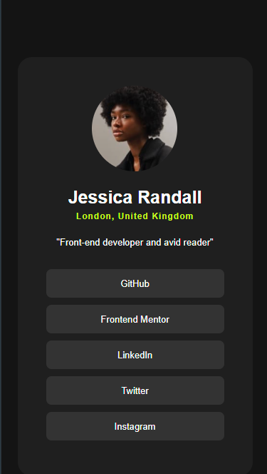

# 🌐 Social Links Profile

Projeto desenvolvido como parte do desafio do **[Frontend Mentor](https://www.frontendmentor.io/)**.  
Este exercício fez parte do módulo de **HTML e CSS** do curso de **Desenvolvimento FullStack** e teve como objetivo reforçar conceitos fundamentais de **estrutura semântica, estilização com CSS, responsividade e boas práticas na organização de arquivos**.  

---

## 📑 Índice
1. [📂 Estrutura do Projeto](#estrutura-do-projeto)  
2. [🚀 Tecnologias Utilizadas](#tecnologias-utilizadas)  
3. [🎯 Conceitos Trabalhados](#conceitos-trabalhados)  
4. [📖 Como Executar o Projeto](#como-executar-o-projeto)  
5. [📸 Prévia do Projeto](#prévia-do-projeto)  
6. [📌 Aprendizados](#aprendizados)  
7. [📍 Status do Projeto](#status-do-projeto)  
8. [👨‍💻 Autor](#autor)  

---

## Estrutura do Projeto

├── index.html  
├── css  
│ ├── reset.css   
│ ├── variables.css  
│ └── style.css   
└── assets  
│ ├── fonts     
│ └── images 


---

## Tecnologias Utilizadas

- **HTML5** → Estrutura semântica.  
- **CSS3** → Flexbox, variáveis CSS, responsividade e microinterações.  
- **Google Fonts (Inter)** → Tipografia moderna.  

---

## Conceitos Trabalhados

- Criação de layouts **responsivos** utilizando **flexbox**.  
- Uso de **variáveis CSS** para padronização de cores e fácil manutenção.  
- Aplicação de **hover states** para melhorar a experiência do usuário.  
- Estruturação de código CSS em **reset**, **variáveis** e **estilos principais**, visando escalabilidade.  
- Organização de pastas e arquivos em um padrão limpo e profissional.  

---

## Como Executar o Projeto

1. Clone este repositório:
   ```bash
   git clone https://github.com/mhrsh/social-links-profile-main.git

2. Acesse a pasta do projeto:
    ```bash
    cd social-links-profile-main


3. Abra o arquivo index.html diretamente no navegador.

    💡 Por ser um projeto 100% estático, não há dependências externas ou necessidade de instalação de pacotes.

## Prévia do Projeto

Layout Desktop  


Layout Mobile  



## Aprendizados

Durante o desenvolvimento deste desafio, aprimorei principalmente:

A importância de resetar estilos para manter consistência entre navegadores.

Como variáveis CSS ajudam a manter um design mais escalável e fácil de modificar.

Melhoria no uso de flexbox para centralização e alinhamento de elementos.

Criação de um layout simples, mas elegante, simulando um cartão de perfil interativo.

## Status do Projeto

✅ Concluído — Projeto finalizado como parte prática dos estudos de HTML e CSS.

## Autor

Desenvolvido por Matheus Hiroshi   
Estudante de Desenvolvimento FullStack